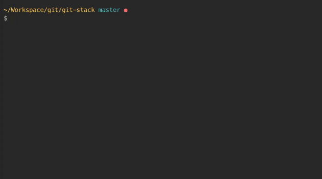

# Git Stack
[](https://www.npmjs.com/package/git-stack)
> A more user-friendly git stash

I've always found `git stash` quite a useful command when I need to save my work temporarily to switching branches or resolve merges. However, I always thought it was a bit cumbersome to utilise properly. More often than not, I find myself typing `git stash` when I meant `git stash list`. Stashes with names such as `stash@{0}: WIP on master: 358db41 End process properly` are not exactly insightful as well. Hence, I wrote `git stack` as friendlier version of `git stash`. It retains semantics such as `push`, `pop`, `apply`, `drop` and `clear`, but offers a more intuitive workflow 

## Installation

```
$ npm install -g git-stack
```

## Usage

There's only one command to remember:
```
$ git stack
```


## Changelog

See [CHANGELOG.md](CHANGELOG.md)

## License

See [UNLICENSE](UNLICENSE)
